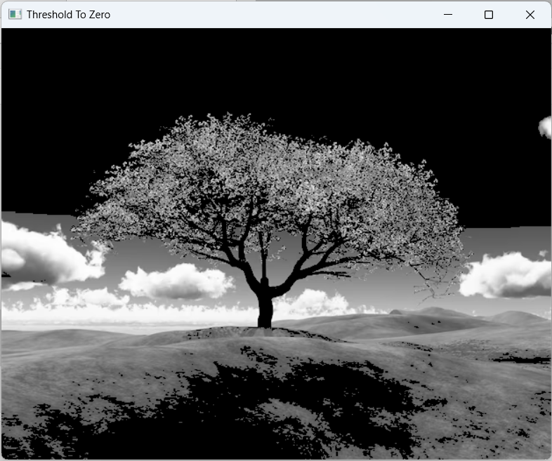

# THRESHOLDING
## Aim
To segment the image using global thresholding, adaptive thresholding and Otsu's thresholding using python and OpenCV.

## Software Required
1. Anaconda - Python 3.7
2. OpenCV

## Algorithm

### Step1:
Import Required package.

### Step2:
Read input image and convert into gray scale.Display the image.

### Step3:
Use global threshold to segment the image.Display the image.

### Step4:
Use adaptive threshold to segment the image.Display the image.
### Step5:
Use Otsu's threshold to segment the image.Display the image.

## Program

```python
# Load the necessary packages

import cv2


# Read the Image and convert to grayscale

img = cv2.imread('test_image.png',1)
cv2.imshow('original_image',img)
cv2.waitKey(0)
cv2.destroyAllWindows
gray =cv2.cvtColor(img,cv2.COLOR_BGR2GRAY)
cv2.imshow('gray_image',gray)
cv2.waitKey(0)
cv2.destroyAllWindows


# Use Global thresholding to segment the image

ret,thresh_img1=cv2.threshold(gray,86,255,cv2.THRESH_BINARY)
ret,thresh_img2=cv2.threshold(gray,86,255,cv2.THRESH_BINARY_INV)
ret,thresh_img3=cv2.threshold(gray,100,255,cv2.THRESH_TRUNC)
ret,thresh_img4=cv2.threshold(gray,86,255,cv2.THRESH_TOZERO)
ret,thresh_img5=cv2.threshold(gray,86,255,cv2.THRESH_TOZERO_INV)


cv2.imshow('Threshold Binary',thresh_img1)
cv2.imshow('Threshold Binary Inverse',thresh_img2)
cv2.imshow('Threshold Trunc',thresh_img3)
cv2.imshow('Threshold To Zero',thresh_img4)
cv2.imshow('Threshold To Zero Inverse',thresh_img5)

cv2.waitKey(0)
cv2.destroyAllWindows


# Use Adaptive thresholding to segment the image

thresh_img6=cv2.adaptiveThreshold(gray,255,cv2.ADAPTIVE_THRESH_MEAN_C,cv2.THRESH_BINARY,11,2)
thresh_img7=cv2.adaptiveThreshold(gray,255,cv2.ADAPTIVE_THRESH_GAUSSIAN_C,cv2.THRESH_BINARY,11,2)

cv2.imshow('Adaptive Threshold Mean',thresh_img6)
cv2.imshow('Adaptive Thresh Gaussian',thresh_img7)

cv2.waitKey(0)
cv2.destroyAllWindows


# Use Otsu's method to segment the image 

ret,thresh_img8=cv2.threshold(gray,0,255,cv2.THRESH_BINARY+cv2.THRESH_OTSU)

cv2.imshow('Otsu Method',thresh_img8)

cv2.waitKey(0)
cv2.destroyAllWindows

```
## Output

### Original Image

### Grayscale Image


### Global Thresholding
#### Binary :

#### Binary Inverted :

#### Truncated :

#### To zero :

#### To zero Inverted :


### Adaptive Thresholding
#### Adaptive Threshold Mean :

#### Adaptive Threshold Gaussian :


### Optimum Global Thesholding using Otsu's Method


## Result
Thus the images are segmented using global thresholding, adaptive thresholding and optimum global thresholding using python and OpenCV.
